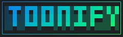

<p align="center">
  
</p>

<p align="center">
  
</p>

<p align="center">
  <a href="https://ko-fi.com/andreaiannoli">
    
  </a>
</p>

# TOONIFY

Universal converter for JSON, YAML, XML, and CSV into the [TOON](https://github.com/toon-format/spec/blob/main/SPEC.md) format with multi-language bindings.

## What’s Included

- **Rust core library** (`toonify-core`) that normalizes the supported formats into TOON while following the spec’s quoting, delimiter, and key-folding rules.
- **First-class decoder/validator** APIs (`decode_str`, `validate_str`) that round-trip TOON into JSON and enforce strict-mode semantics (array counts, indentation, path-expansion conflicts, etc.).
- **CLI** (`toonify-cli`) for one-shot conversions, TOON → JSON decoding, or standalone validation.
- **Node.js bindings** (`bindings/node`, powered by `napi-rs`) that expose encode/decode/validate helpers to JavaScript/TypeScript.
- **Python bindings** (`bindings/python`, powered by PyO3 + maturin) with the same surface area.
- **Docker image** for CI/automation scenarios where you just want a containerized CLI.

All targets share the same encoder options:

| Option | Description |
| --- | --- |
| `format` | `json`, `yaml`, `xml`, `csv`, or `auto` (sniffs input when possible) |
| `delimiter` | `comma` (default), `tab`, or `pipe` |
| `indent` | Spaces per indentation level (default `2`) |
| `key_folding` | `off` (default) or `safe` (dotted paths for single-key object chains) |
| `flatten_depth` | Optional limit for the number of folded segments |

TOON decoding/validation options mirror the spec:

| Option | Description |
| --- | --- |
| `indent` | Expected indentation width in spaces (default `2`) |
| `expand_paths` | `off` (default) or `safe` dotted-path expansion |
| `loose` / `strict` | Disable (`loose`) or enable (`strict`, default) array count and indentation validation |
| `pretty` | When decoding, pretty-print JSON output |

## Install the CLI globally

You can make the `toonify-cli` binary available on your `PATH` without referencing `target/release`:

```bash
# build and install the local workspace binary
cargo install --locked --path crates/toonify-cli

# once published on crates.io you can also do:
# cargo install --locked toonify-cli
```

`cargo install` drops binaries into `~/.cargo/bin`, so make sure that directory is on your `PATH`. Afterwards you can run commands such as `toonify-cli --input data.json --format json` from anywhere.

## Getting Started

```bash
# Build the CLI (requires Rust 1.76+)
cargo build --release -p toonify-cli

# Convert a JSON file
./target/release/toonify-cli --input fixtures/data.json --format json --key-folding safe
```

### CLI Quick Reference

```
toonify-cli --input users.yaml --format yaml --delimiter tab --key-folding safe --flatten-depth 3

# STDIN → STDOUT
curl https://example.com/users.csv | toonify-cli --format csv

# Decode TOON → JSON
toonify-cli --mode decode --input users.toon --pretty-json

# Validate a TOON document (strict-mode by default)
toonify-cli --mode validate --input users.toon
```

Run `toonify-cli --help` to view every flag.

### Node.js Package

```bash
cd bindings/node
npm install
npm run build    # produces index.node via @napi-rs/cli
```

```ts
// bindings/node/example.mjs
import { convertToToon, decodeToJson } from '@toonify/node';

const input = JSON.stringify({ users: [{ id: 1, name: 'Ada' }] });
const toon = convertToToon(input, { format: 'json', keyFolding: 'safe' });
console.log(toon);

const json = decodeToJson(toon, { pretty: true });
console.log(json);
```

Publish by running `npm pack` (after `npm run build -- --release`) and pushing to your registry of choice.

### Python Package

```bash
cd bindings/python
pip install maturin
maturin develop   # builds & installs the extension into the active virtualenv
```

```python
from toonify import convert_to_toon, decode_to_json, validate_toon

input_doc = '{"items":[{"id":1,"name":"Ada"}]}'
print(convert_to_toon(input_doc, format="json", key_folding="safe"))

toon_doc = '''
users[2]{id,name}:
  1,Ada
  2,Bob
'''
print(decode_to_json(toon_doc, pretty=True))
validate_toon(toon_doc)
```

Ship wheels via `maturin build --release` and upload them with `twine`.

### Docker Image

```bash
docker build -t toonify .
docker run --rm -v $PWD:/data toonify --input /data/users.json --format json
```

Set `ENTRYPOINT` to `toonify`, so passing CLI flags works naturally.

## Testing

- (Optional) run integration tests inside the CLI crate or bindings.

> **Note:** This repository does not ship a `Cargo.lock` yet; run `cargo generate-lockfile` before reproducible builds.

## Roadmap / Ideas

- Expand the decoder to support more formats (CSV, YAML, etc.)
- Add a token saving estimation mechanism

Contributions are welcome—feel free to open issues or PRs with improvements!
